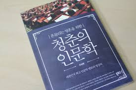

3월 중순 이 책을 접하게 되었다. 약 3일 이라는 시간 동안 짬짬이 읽어본 책이다.

흔들리는 청춘들 즉 학교에 다니고 있는 학생들, 이제 갓 졸업을 한 사회초년생들에게 들려주고 싶은 이야기들을 인문학적으로 잘 풀어낸 책이다.

**인문학** 나에겐 너무 어려운 주제로 와닿았다. 사실 별로 관심 없는 주제이기도 했다.
하지만 이 책을 통해서 접해본 인문학은 꽤 흥미로웠고 재밌었다.

작가가 대학교에서 인문학 강의를 했던 자료를 토대로 책이 집필 되었다. 그래서 책을 읽을 때면 학교에서 재밌는 인문학 강의를 듣는 것 같아서 더 좋았던 것 같다.

---

> 인생을 제대로 살려면 지난 시간을 돌아보고 반성할 수 있어야 합니다. 그것이 진짜 인생 공부고 자기를 아는 공부입니다.

나 자신을 돌아 볼 수 있는 시간을 갖는 것이 굉장히 중요하다고 한다.
내가 걸어온 길을 따라서 나는 어떻게 여기까지 걸어왔는지 그 과정에서 얻은 것은 무엇이고 잃은 것은 무엇인지 알아둘 필요가 있다고 느껴진다.

이렇게 과거의 나를 잘 알기 위해서는 어떻게 해야하는 것인지 궁금해지기도 한다.
현재 떠오르는건 기록 밖에 없는 것 같다. 매일 쓰는 일기나 작업일지를 통해서 내가 어떻게 걸어왔고, 지금 현재 느끼는 감정들을 적어 놓는 습관을 갖는 것이 중요할 것 같다.
과거를 돌아보는 것 만큼이나 중요한건 현재에 충실하며 현재를 기록하는 것.

---

> 미래가 두려운 것은 너무 화려한 미래를 꿈꾸기 때문입니다.
> 그렇게 되지 못할까 봐 두려운 거죠.

미래를 꿈꾸는 것은 당연하다고 생각한다. 내 마음대로 미래를 그리는 것 만큼 힘들지 않고 즐거운 일은 없을 것 같다.
하지만 작가는 이런 화려한 미래를 내려 놓으라고 한다. 화려한 미래를 꿈꾸기 때문에 현실의 내가 미래를 두려워하는 것이라고 한다.

맞는 말인 것 같으면서, 미래를 꿈꾸며 그 미래를 위해 달리고 있는 사람들도 과연 미래가 두렵다고 느낄까?

화려한 미래를 꿈꾸지만, 현실에서는 아무것도 하지 않는 사람들이 두렵다고 느끼는건 아닐까?

두가지 생각이 동시에 들었다.

- **첫번째**는 내가 동경하는 사람들에 대한 나의 상상
- **두번째**는 지금 나의 상황.. 솔직히 난 내 미래가 두렵다.

---

### 좋아하는 일로 하루를 채우면

- `"아니 어떻게 좋아하는 것만 하며 살아? 좋아하는 것만 하며 즐겁게 사는 사람이 몇이나 될까?`
- `"내가 좋아하는 것이 무엇인지 아는 사람이 몇이나 될까?"`

그럼, `"나는 ?"...`

뭔가 머릿속에 떠오르는 단어는 있지만 정말 그게 맞는 것인가에 대한 생각이 겹치면서 이런 생각이 들면 좋아하는게 맞는건가? 라는 생각도 들면서.. 복잡 미묘하다.

---

### 인생의 주체가 되어야 어른이된다. 내 인생의 주관을 갖고 살고 있는가?

나는 언제부터인지 모든 일에 수동적으로 임했고 누가 하라면 하고, 하지 말라면 하지말고, 나의 생각을 남에게 표출하지 않았다.

두려워서 그랬다.

`내가 한말에 공감을 하지 않으면 어쩌나, 혹시 내가 잘못된 정보를 말하는 것은 아닌가, 저 사람이 나를 이상하게 생각하면?`
이미 나의 머릿속에는 그 상황이 닥치지도 않았는데도 불구하고 말도 안되는 이상한 상상으로 가득 차버리곤 했다.

그래서 다른 사람들이 나를 대할 때 나의 대한 정보를 알 수 없기도하고, 내가 무슨 생각을 하는지도 알 수 없어 분명 답답했을 것이다.

이게 진짜 나인가?

그렇다. 그렇게 하루 이틀 일년 이년이 지나도 여전히 그렇다. 그 동안 누구도 뭐라고 하는 사람이 없었고, 과감하게 생각을 표현해도 되는 환경에 있음에도 불구하고 그랬다.

바꾸고 싶었다. 조금이나마 내 삶의 주체가 나이길 원했고, 다른 사람의 눈치를 보지 않고 살고 싶었고, 인정받지 않아도 내가 행복한 삶을 살고 싶었다.

내가 남들과 함께 있을 때, 그런 생각을 갖고 삐딱한 자세로 임하고 있는걸까? 그래서 남들도 그런 시선으로 그런 생각으로 날 볼 것 이라고 생각하는 건가?
잘 모르겠다. 생각의 꼬리가 꼬리를 물고 나를 좀먹는 기분이라 이런 생각은 하지 않기로 했다.

그냥, 내 생각을 표출하고 그냥 냉정하게 피드백 받고 하면 되는것 아닌가? 평가야 어떻든 현실을 살아가려면 이런 것들에 벽을 느끼고 앞으로 헤어나가지 못하면 안된다.

그냥 있는 그대로를 나를 보여주고 싶은데, 그렇게 하는 법을 까먹어버린 것 같다.

그냥 최대한 내 생각을 표현하는 연습하면서 주변 사람들에게 빡시게 피드백 받을 수 있도록 노력하는 수 밖에..

생각해보니 이게 나의 가장 큰 문제점인 것 같다.

---

### 행동력

생각을 행동으로 옮기는 것에 능한 사람들이 부러울 때가 많다. `나 이제 부터 이렇게 살꺼야` 라고 말하고 진짜 그렇게 살아가도록 노력하는 사람들

나의 기준에서는 그런 사람들이 멋지게 느껴졌고, 나는 할 수 없는 일일 것이라고 자기합리화 하며 지내왔다. 그러면 마음이 편해지니까.

그러면서 내 인생에 도전적인 일들은 꼭 해야하는 일이 아닌 일로 자리 잡게 되었던 것 같다.
그렇다고 딱히 그 시간에 다른 의미 있는 일을 하면서 지냈던것도 아니다.

하지만 어느 순간부터 이 게으름과 합리화를 깨부수고 싶어졌다. `나도 하루를 의미 있게 시간을 보내고 싶어` 라고 느끼고, 행동했던 첫번째가 독서다.

---

### 책 읽는 습관 들이기

책을 읽으면 좋다는 것은 누구나 아는 사실이다. 하지만 어려워 한다. 나도 하루에 수십번 씩 책을 읽어야 한다는 생각이 머리를 스친다.
그렇기 때문에 항상 가방에는 읽을 만한 책 현재 내가 읽고 있는 책을 넣고 다닌다.

뭔가 책을 가지고 다니는 것만으로도 나 스스로에게 뿌듯함을 느낄 때가 있는 것 같다. 시간이 날 때, 책을 꺼내어 보는 것 까지 하면 뿌듯함이 배가 된다.
이렇게 언제나 어디서나 책을 볼 수 있게 책을 가지고 다니지만, 진짜 가지고 다니는 정로만 그치는 날도 많았다.

`사람의 마음은 약간의 압력이 있어야 잘 작동한다` 라는 말에 공감한다. 내가 일주일 내에 이 책을 다 읽을거야. 라고 목표를 정해 두면 그 약간의 압력이 행동으로 이어지는 경우도 많았던 것 같다. 여기서 주의할 점은 목표가 너무 길어서는 안된다는 점. 목표가 길어지면 긴장이 풀어지기 마련이다.

책 읽기를 매일 반복해야 한다는 강박에 시달리지 말자. 내가 읽고 싶을 때, 읽으면 좋을 것 같은 때에 읽자.

다만, 핸드폰을 하며 보내는 시간이 책 읽는 시간보다 많아지지 않도록 노력 하면서.

---

### ...

여전히 글쓰기는 어렵다. 청춘의 인문학을 읽으며 느꼈던 것들을 노트에 따로 적어 두긴 했지만, 막상 블로그에 남기려고 하니 건질 내용이 많지 않았다.
분명 3월에 읽은 책인데, 기억이 나질 않는다. 인상 깊게 읽은 곳을 접어두긴 했지만 막상 내가 어디를 인상 깊게 읽었는지 그 페이지를 읽어봐도 잘 모르겠다.

다시 읽어야겠다는 생각이 든다.

이번에는 블로그를 위해서라도 인상 깊은 구절을 새기며 읽어야겠다.

이 글은 언젠가 완성이 되겠지.