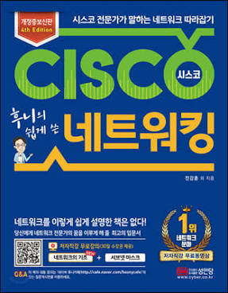

처음으로 네트워킹 관련된 책을 샀다. 대학에서 가장 흥미롭게 공부했던 과목은 DB 였다. (지금은 전혀 DB와 관련된 일을 하고 있지 않다.) 네트웤은 음.. 배웠었던 것 같은데 기억에 잘 나질 않는다.

현재 우리는 인터넷이라는 엄청나게 거대한 네트웤 속에서 살아가고 있다. 정확히 우리는 어떻게 이렇게 거대한 인터넷이라는 환경을 만들게 되었고, 이 인터넷이라는 것은 어떻게 동작하는지 문득 궁금해졌다.

사실은, CS 하다가 네트웤 관련한 이슈를 접하고 그걸 처리하는 과정에 대한 설명을 들으니 내가 많이 부족하구나 라는 것을 새삼 느끼며 이 책을 추천 받아 읽게 되었다.

차근차근 읽으며, 내가 몰랐던 부분 중요하다고 느끼는 부분에 대한 간략한 설명과 함께 정리를 해보려고 한다.